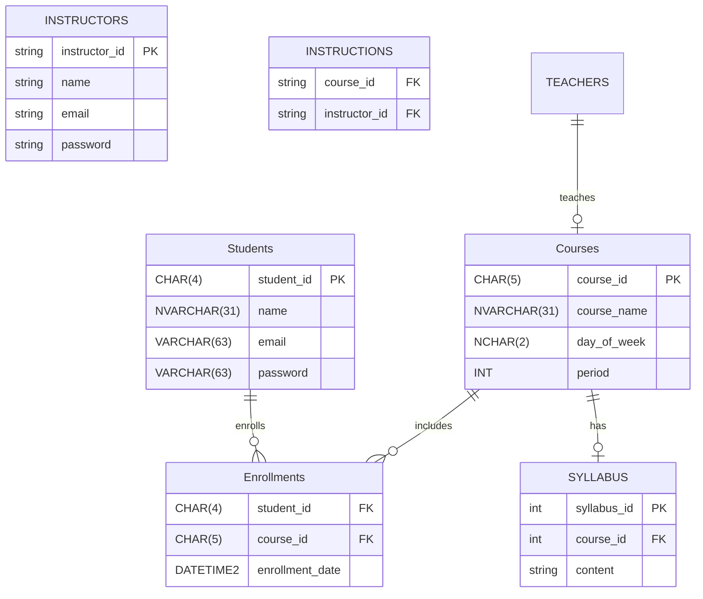

```mermaid
erDiagram
    Students {
        CHAR(4) student_id PK
        NVARCHAR(31) name
        VARCHAR(63) email
        VARCHAR(63) password
    }
    
    INSTRUCTORS {
        string instructor_id PK
        string name
        string email
        string password
    }
        
    Courses {
        CHAR(5) course_id PK
        NVARCHAR(31) course_name
        NCHAR(2) day_of_week
        INT period
    }
    
    Enrollments {
        CHAR(4) student_id FK
        CHAR(5) course_id FK
        DATETIME2 enrollment_date
    }

    INSTRUCTIONS {
        string course_id FK
        string instructor_id FK
    }
    
    SYLLABUS {
        int syllabus_id PK
        int course_id FK
        string content
    }
    
    Students ||--o{ Enrollments : enrolls
    Courses ||--o{ Enrollments : includes
    TEACHERS ||--o| Courses : teaches
    Courses ||--o| SYLLABUS : has
```