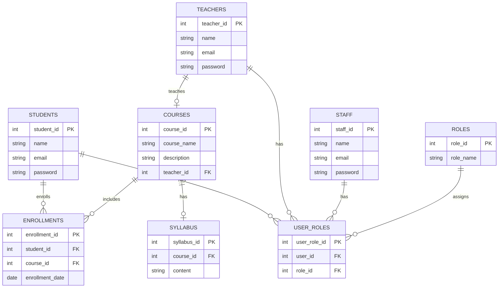

```mermaid
erDiagram
    STUDENTS {
        int student_id PK
        string name
        string email
        string password
    }
    
    TEACHERS {
        int teacher_id PK
        string name
        string email
        string password
    }
    
    STAFF {
        int staff_id PK
        string name
        string email
        string password
    }
    
    COURSES {
        int course_id PK
        string course_name
        string description
        int teacher_id FK
    }
    
    ENROLLMENTS {
        int enrollment_id PK
        int student_id FK
        int course_id FK
        date enrollment_date
    }
    
    SYLLABUS {
        int syllabus_id PK
        int course_id FK
        string content
    }
    
    ROLES {
        int role_id PK
        string role_name
    }
    
    USER_ROLES {
        int user_role_id PK
        int user_id FK
        int role_id FK
    }
    
    STUDENTS ||--o{ ENROLLMENTS : enrolls
    COURSES ||--o{ ENROLLMENTS : includes
    TEACHERS ||--o| COURSES : teaches
    COURSES ||--o| SYLLABUS : has
    STUDENTS ||--o{ USER_ROLES : has
    TEACHERS ||--o{ USER_ROLES : has
    STAFF ||--o{ USER_ROLES : has
    ROLES ||--o{ USER_ROLES : assigns
```