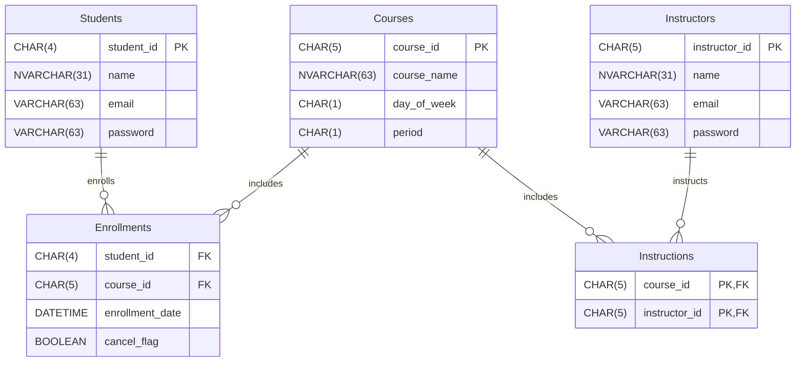

# ER図
@version: 1.2.0

```mermaid
erDiagram
    Students {
        CHAR(4) student_id PK
        NVARCHAR(31) name
        VARCHAR(63) email
        VARCHAR(63) password
    }
    
    Instructors {
        CHAR(5) instructor_id PK
        NVARCHAR(31) name
        VARCHAR(63) email
        VARCHAR(63) password
    }
        
    Courses {
        CHAR(5) course_id PK
        NVARCHAR(63) course_name
        CHAR(1) day_of_week
        CHAR(1) period
    }
    
    Enrollments {
        CHAR(4) student_id FK
        CHAR(5) course_id FK
        DATETIME enrollment_date
        BOOLEAN cancel_flag
    }

    Instructions {
        CHAR(5) course_id PK,FK
        CHAR(5) instructor_id PK,FK
    }
        
    Students ||--o{ Enrollments : enrolls
    Courses ||--o{ Enrollments : includes
    Courses ||--o{ Instructions : includes
    Instructors ||--o{ Instructions : instructs
```