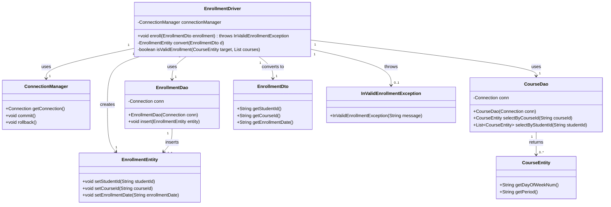

```mermaid
classDiagram
    class EnrollmentDriver {
        -ConnectionManager connectionManager
        +void enroll(EnrollmentDto enrollment) throws InValidEnrollmentException
        -EnrollmentEntity convert(EnrollmentDto d)
        -boolean isValidEnrollment(CourseEntity target, List<CourseEntity> courses)
    }

    class ConnectionManager {
        +Connection getConnection()
        +void commit()
        +void rollback()
    }

    class EnrollmentDao {
        -Connection conn
        +EnrollmentDao(Connection conn)
        +void insert(EnrollmentEntity entity)
    }

    class CourseDao {
        -Connection conn
        +CourseDao(Connection conn)
        +CourseEntity selectByCourseId(String courseId)
        +List~CourseEntity~ selectByStudentId(String studentId)
    }

    class EnrollmentDto {
        +String getStudentId()
        +String getCourseId()
        +String getEnrollmentDate()
    }

    class EnrollmentEntity {
        +void setStudentId(String studentId)
        +void setCourseId(String courseId)
        +void setEnrollmentDate(String enrollmentDate)
    }

    class CourseEntity {
        +String getDayOfWeekNum()
        +String getPeriod()
    }

    class InValidEnrollmentException {
        +InValidEnrollmentException(String message)
    }

    EnrollmentDriver "1" --> "1" ConnectionManager : uses
    EnrollmentDriver "1" --> "1" EnrollmentDao : uses
    EnrollmentDriver "1" --> "1" CourseDao : uses
    EnrollmentDriver "1" --> "1" EnrollmentDto : converts to
    EnrollmentDriver "1" --> "1" EnrollmentEntity : creates
    EnrollmentDriver "1" --> "0..1" InValidEnrollmentException : throws
    EnrollmentDao "1" --> "1..*" EnrollmentEntity : inserts
    CourseDao "1" --> "0..*" CourseEntity : returns
```